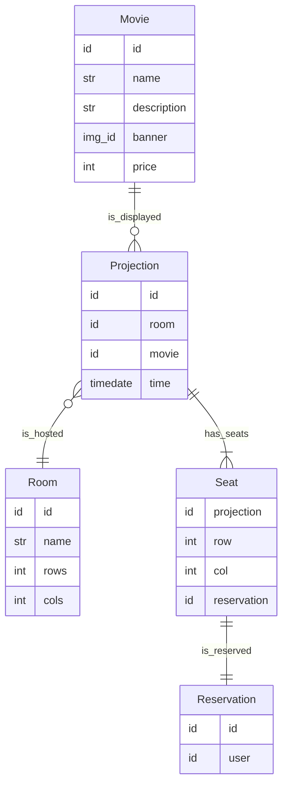

```mermaid
erDiagram
    Movie {
        id id
        str name
        str description
        img_id banner
        int price
    }

    Room {
        id id
        str name
        int rows
        int cols
    }

    Projection {
        id id
        id room
        id movie
        timedate time
    }

    Movie ||--o{ Projection : is_displayed
    Projection }o--|| Room : is_hosted

    Seat {
        id projection
        int row
        int col
        id reservation
    }

    Projection ||--|{ Seat : has_seats

    Reservation {
        id id
        id user
    }

    Seat ||--|| Reservation : is_reserved

```

## Doubts:
- Row and col in seat should be related to the room dimensions?
- User?