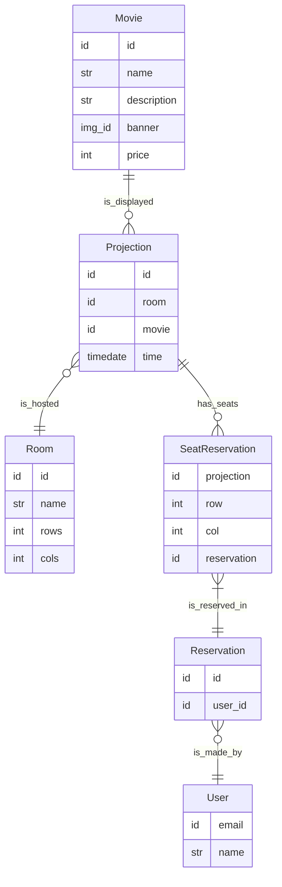

## Features:
- Login / Sign up:
  - Handled by Firebase Auth.
  - The email and the name are stored in the database.
- Database will use FireStore database for the data.
- Database will use Storage for the resources:
  - Img banner in Movie.
- A user can make a reservation for a movie projection:
  - Can book one or multiple seats.
  - Once done, it can not change or delete the reservation.
- In the database level, a seat in a projection can have 2 states:
  - Available: Any user can book it with a reservation.
  - Used: A user booked it with a reservation.
- If there is no admin control, all data in the following data sources is constant:
  - Room
  - Movie
  - Projection

## Notes:
- Row and col in seat should be related to the room dimensions.
  - It will be verified by our API.